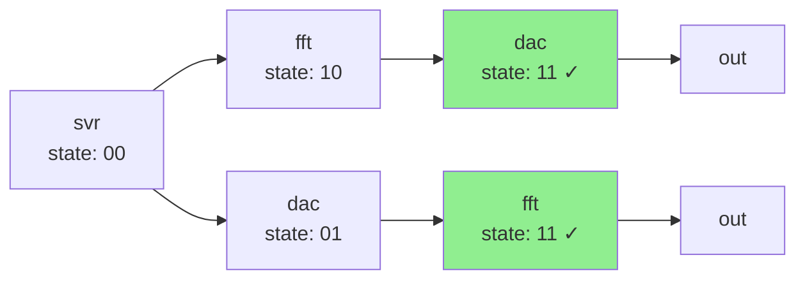

# Day 11: Reactor

## Problem Statement

Given a directed graph representing devices and their connections, count paths between specified nodes. Part 1 requires counting all simple paths (no cycles) from "you" to "out". Part 2 adds constraints: count paths from "svr" to "out" that must visit both "dac" and "fft" (in any order).

### Example Input
```
you: bbb ccc
bbb: ddd eee
ccc: ddd eee fff
ddd: ggg
eee: out
fff: out
ggg: out
```

### Example Output
- Part 1: `5` (paths from "you" to "out")
- Part 2: `2` (paths from "svr" to "out" visiting both "dac" and "fft")

## Algorithm & Approach

### Part 1: DFS with Backtracking

The straightforward approach uses depth-first search with backtracking to enumerate all simple paths.

**Data Structure:** `HashMap<&str, Vec<&str>>` adjacency list
- Uses string slices to avoid allocations
- O(1) lookups for neighbors

**Algorithm:**
1. Parse input into adjacency list
2. DFS from "you" tracking visited nodes
3. Count paths reaching "out"
4. Backtrack (remove from visited) to allow reuse in other paths

**Key Insight:** Backtracking is essential - nodes can appear in multiple paths, just not in the same path (cycle prevention).

**Complexity:**
- Time: O(V + E) × P where P = number of paths (exponential worst case)
- Space: O(V) for visited set and recursion stack

For sparse graphs with moderate path counts, this is very efficient.

### Part 2: DFS with Memoization

Part 2 revealed the true challenge: the actual input has ~462 trillion paths! The naive approach times out.

**Problem Evolution:**
- Initial attempt: Extended Part 1 DFS to track required nodes → timeout (>30s)
- Insight: Massive path overlap creates repeated subproblems
- Solution: Memoization with state tracking

**State Representation:**
Use 2-bit state to track which required nodes have been visited:
- `00` (0): Neither dac nor fft visited
- `01` (1): Only dac visited
- `10` (2): Only fft visited
- `11` (3): Both visited (valid terminal state)

**Memoization Strategy:**
Cache `(node, state) → path_count` to avoid recomputing identical subproblems.

**Critical Optimization:**
Only memoize when node is NOT in current path (cycle detection). This balances:
- Cache hits on overlapping subpaths
- Correctness for cycle prevention

**Algorithm:**
1. DFS from "svr" with state = 0
2. Update state when visiting dac (set bit 0) or fft (set bit 1)
3. At "out", count only if state == 3 (both visited)
4. Memoize results for reuse

**Complexity:**
- Time: O(V × S × E) where S = states (4), amortized by memoization
- Space: O(V × S) for memo table + O(V) for visited set

**Performance:** Reduced from timeout to **551 µs** - over 50,000× speedup!

## Implementation Notes

### Zero-Copy String Slicing
Uses `&str` throughout instead of `String`:
```rust
fn parse_graph(input: &str) -> HashMap<&str, Vec<&str>>
```
This avoids allocating node names, keeping parsing fast.

### Bit Flag State Tracking
Elegant state representation using bitwise operations:
```rust
let new_state = match current {
    "dac" => state | 1,  // Set bit 0
    "fft" => state | 2,  // Set bit 1
    _ => state,
};
```
Efficiently tracks 2 required nodes in a single `u8`.

### Memoization Pattern
The memoization check has a subtle but important pattern:
```rust
// Only check memo if NOT in current path
if !visited.contains(current) {
    if let Some(&cached) = memo.get(&(current, state)) {
        return cached;
    }
}
```
This prevents incorrect cache hits during cycle detection while still benefiting from memoization.

### Performance Characteristics
The solution demonstrates classic space-time tradeoff:
- Part 1: Minimal memory, explores all paths
- Part 2: Memo table overhead, dramatically reduced computation

## Alternative Approaches Considered

### 1. Direct Constraint Tracking (Implemented but replaced)
Extended Part 1 DFS to track `required_visited` HashSet. Clean and straightforward, but times out on Part 2 due to lack of memoization. Good for small graphs, insufficient for exponential path counts.

### 2. Three-Phase Path Decomposition
Break into subproblems:
- Count paths: svr → dac → fft → out
- Count paths: svr → fft → dac → out
- Combine results

**Rejected:** Risk of double-counting, more complex logic, no clear performance benefit over memoization.

### 3. Bottom-Up Dynamic Programming
Build path counts backward from "out" to "svr".

**Trade-offs:** Similar performance to top-down memoization, but less intuitive for path enumeration. Top-down approach maps more naturally to the problem.

### 4. State Machine Enumeration
Track state transitions explicitly: `NeitherVisited → OnlyDac → Both`.

**Rejected:** Essentially equivalent to bit flags but more verbose. Bit manipulation is cleaner for this problem size.

## Visualizations



State transitions for Part 2: only paths reaching state `11` (both required nodes visited) count.

---

**Key Takeaways:**
- Memoization with state tracking transforms intractable problems into sub-millisecond solutions
- Zero-copy string slicing (`&str`) provides clean, fast parsing without allocation overhead
- Backtracking enables elegant path enumeration while preventing cycles
- The space-time tradeoff is dramatic: O(V×S) memo space buys 50,000× speedup
- Bit flags offer elegant state representation for small constraint sets
